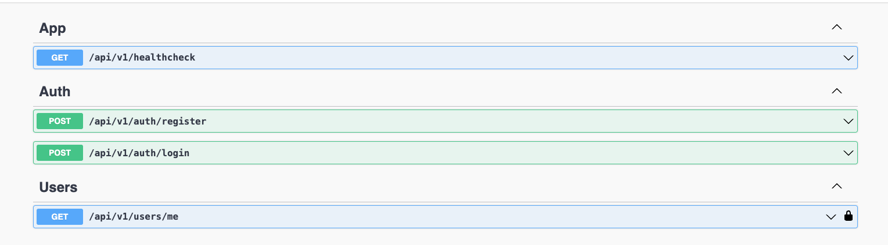
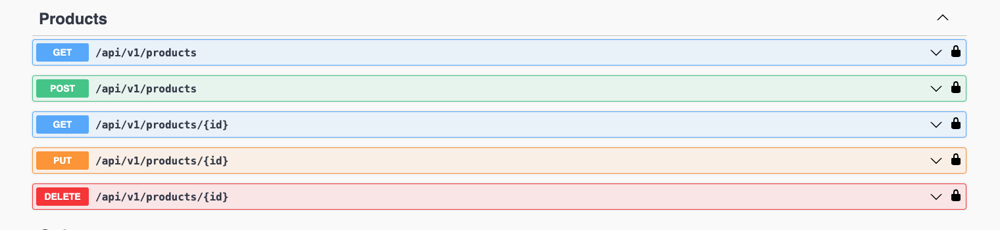
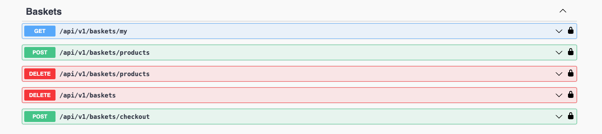
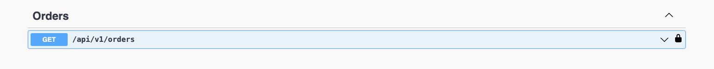

# NestJS E-Commerce Application Backend

## Prerequisites:

Ensure you have the following tools installed in your PC:

- NodeJS (along with npm)
- NestJS
- Postgres

## Run project:

1. Clone the repository:

```sh
git clone https://github.com/grishahovhanyan/nestjs-e-commerce-app.git
```

2. Navigate to the project directory:

```sh
cd nestjs-e-commerce-app
```

3. Run the following command to install all dependencies:

```sh
npm install
```

4. Create a .env file from the provided .env.example file.

```sh
cp .env.example .env
```

5. To run migrations, use the following command:

```sh
npm run migrations:run
```

6. To run the development environment, use the following command:

```sh
npm run start:dev
```

After starting the server, you can access the application at: http://localhost:PORT_FROM_ENV/swagger-ui/

## Run project with docker:

1. After clone go to the project directory and create a .env file from the provided .env.example file.

```sh
cp .env.example .env
```

2. Build a Docker image for project using the Dockerfile located in the "docker" directory.

```sh
docker build . -f docker/Dockerfile
```

3. Run a Docker container using the image created in the previous step.

```sh
docker run --entrypoint /usr/src/app/docker/entrypoint.sh -it IMAGE_ID_FROM_PREVIOUS_STEP /usr/src/app/docker/start_node.sh
```

## Run project with docker compose:

1. After clone go to the project directory and create a .env file from the provided .env.example file.

```sh
cp .env.example .env
```

2. Build Docker images for a multi-container application defined in a Docker Compose file.

```sh
docker compose up --build
```

3. Run Docker containers based on the images created in the previous step.

```sh
docker compose up
```

## API V1 Endpoints

### Auth:

- **Register:** `GET /auth/register/`
- **Login:** `GET /auth/login/`
- **Get current user:** `GET /users/me/`



### Products:

- **Get products:** `GET /products/`
- **Create product:** `POST /products/`
- **Get product by Id:** `GET /products/:id/`
- **Update product by Id:** `PUT /products/:id/`
- **Delete product by Id:** `DELETE /products/:id/`



### Baskets:

- **Get current user basket:** `GET /baskets/my/`
- **Add product to basket:** `POST /baskets/products/`
- **Remove product from basket:** `DELETE /baskets/products/`
- **Empty basket:** `DELETE /baskets/`
- **Checkout basket:** `POST /baskets/checkout/`



### Orders:

- **Get current user orders:** `GET /orders/`



## Useful commands

- `npm run build` compile typescript to js
- `npm run lint` run the linter to check for code quality issues
- `npm run migrations:generate` generate migrations based on entities
- `npm run migrations:rollback` rollback the last migration
- `npm run start:prod` start the application in production mode

## Author

- **Grisha Hovhanyan** - [github:grishahovhanyan](https://github.com/grishahovhanyan)
